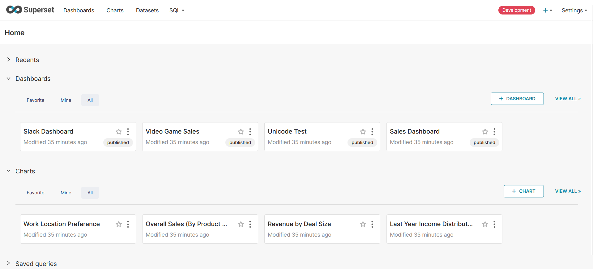
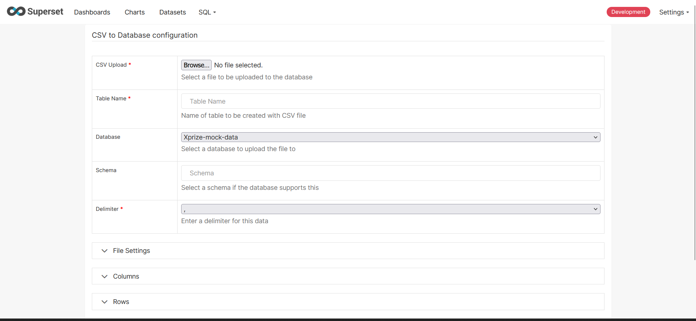

# XPrize Superset Deployment 

## 1. Docker 

### 1.1 What is Docker? 

Docker is an open platform for developing, shipping, and running applications. Docker enables you to separate your applications from your infrastructure so you can deliver software quickly. With Docker, you can manage your infrastructure in the same ways you manage your applications. 

### 1.2 Installing Docker Desktop

Docker Desktop is an easy-to-install application for your Mac, Windows or Linux environment that enables you to build and share containerized applications and microservices. 

Why install Docker?

We are installing docker because to run any Docker command on the terminal, such as running an application, it will not be possible without Docker Desktop installed. 

Here is the link to install Docker Desktop: [installation](https://docs.docker.com/desktop/).

Pick the right installation for your local computer or laptop.

Once installed, sign up for an account with Docker Desktop. You can use your personal or work email.

### 1.3 The Natural State Superset Visualization Platform

The Natural State Impact Portal (NIP) Superset repository contains the dashboard visualization platfrom known as [Superset](https://github.com/apache/superset). It is a dashboard for creating Business Intelligence (BI) visualizations. 

To have the NIP Superset in your local machine, open VS Code and in the terminal, type: 

```
git clone https://github.com/Natural-State/NIP-Superset.git

```

This will clone the up-to-date NIP Superset into your local machine.

The branch `3.1.1` will be downloaded by default. 

Create a new branch based on the `dev` branch which is used for active development by running this: 

```
git checkout -b <name-of-your-branch> origin/dev
```

Ensure you are in the right branch by running:

```
git branch

```

Let's say you have named your branch as `xprize` or something, you will instantiate the Superset dashboard using: 

```
docker compose up

```

This should create a list of logs. Besides the logs, a new widget should show up asking you to go to a specific port path in your browser. Otherwise, just go to this port on your browser:

```
localhost:8088
```

or

```
http://127.0.0.1:8088/login/
```

Login using the Azure email provided by your data administrator.

#### Troubleshooting

If unable to login, some additional instructions will be provided by your data administrator. ie. the `env` file might need to be changed to something else. 


## 2. Converting Comma Separated Files (CSVs) to Sqlite Database

### 2.1 What is an Sqlite Database?

SQLite is a lightweight relational database systems favoured for its light, simplicity and no-administration required features.

### 2.2 Convert csv files to sqlite database

Attached to this folder is a python file called `cd_to_db_converter.py`. 

It has two functions:

1. `create_database`

2. `read_table_from_db`

To load and use these functions in any python file, import them as follows:

```
from cd_to_db_converter import create_database
from cd_to_db_converter import read_table_from_db
```

i. The **`create_database`** function

The purpose of this function is to convert your csv file(s) to a SQLite database. It only needs three parameters: 

- `csv_folder` - path to your csv files, 
- `database_path` - desired path to your database and,
- `database_name` - desired name of the database  

The function does the heavy lifting of conversion from csv to sqlite database for you.

For example, to convert csv file(s) from the path `/home/user/github4/csv_files` to a sqlite database called `xprize_database` in the path `/home/sammigachuhi/github4/coding/database` we would format the function as follows:

```
create_database(
    csv_folder="/home/sammigachuhi/github4/csv_files",
    database_path="/home/sammigachuhi/github4/coding/database",
    database_name="xprize_database"
    ) 
```

The database will take care of the extension name `.db` for you!

**NB**: For Mac and Unix users (Ubuntu, Linux) you should ensure your path starts with `/` but this is not required for windows users.

ii. The **`read_table_from_db`** function

It is always important to check that the output of a function is behaving correctly. To check if your table(s) is correctly saved and readable from the database, use the `read_database` function.

It takes two outputs only. 

- `table_name` - this is the name of your csv without the `.csv` extension
- `database_path` - this the full path to where your database is located. 

Here is an example: 

```
read_table_from_db("mock_sensor_operation_table", "/home/sammigachuhi/github4/coding/database/xprize_database.db")
```

**NB**: For Mac and Unix users (Ubuntu, Linux) you should ensure your path starts with `/` but this is not required for windows users. Windows users can just use `C:/<path>`.

**NB**: The python file `test_cd_to_db.py` has been provided as a playground to test these two functions. 


### 2.3 Add the sqlite database to superset

The good thing that is that reading of sqlite database is supported by Superset by default. However, in order to read it, a few changes must be made.

** Only for Investigation**

Inside the repository you cloned from Part 1.3 above, go to the  `config.py` file inside the `superset` folder. 

Ensure line 19 is changed to False, as follows:

```
PREVENT_UNSAFE_DB_CONNECTIONS = False
```

Otherwise the above should have been taken care of for you. 

To cancel a running container, type `Ctrl + C`. Then type `docker compose up` to build and run the container with the above new configurations.

Go to this login page `http://localhost:8088/` in a private browser.

Login using your provided azure credentials. 

A Superset home page should appear as follows: 



Go to **Settings>Database Connections>+ Database**.

Choose SQLite from *Select a database to connect* options.

In the Basic tab, insert the SQLALCHEMY URI space with the path to your sqlite database but there is a **caveat**. You will append the world `sqlite` before the path to tell Superset that this is a sqlite database it is reading!

```
sqlite:///C:\\Users\\sammi\\Downloads\\csv_data7.db?check_same_thread=false
```

Click `Test Connection`. If everything is okay, a "... looks good" message should appear.


## 3. Adding CSVs to the Database in Superset

### 3.1 Manual upload of csvs to SQLite Database in Superset

For some reason, superset isn't reading uploaded sqlite databases. Luckily, there is a workaround. 

Under the **Advanced Options, click the `Allow file uploads to database` options. 

Click Finish. 

Go to **Upload files to database>Upload csv**. 

An interface should appear as follows:



Browse to the csvs you want to upload. 

The table name should be the name of the csv without the `.csv` extension. For example, if the csv is *mock_sensor_operations.csv* the table name will be `mock_sensor_operations`. 

Click save.

The first table takes a while but subsequent ones are faster.

Once done, go back to the **Settings>Database Connections>+ Database**, click the **Edit** button next to the database you just uploaded. 

Go to the **Advanced** menu.

Under the **Security** tab, uncheck the *Allow file uploads to database*. This is so as to ensure no other tables are added to the database once you have uploaded all the csvs. 


