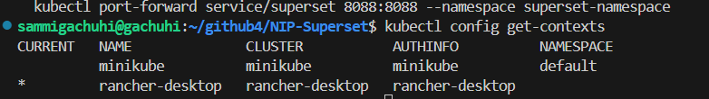
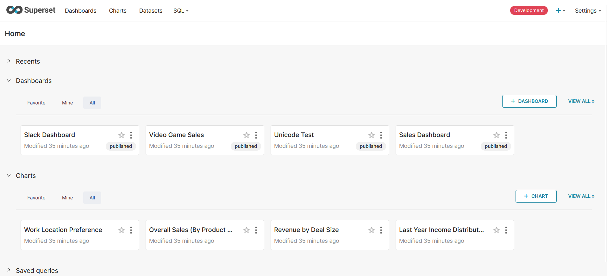

# XPRIZE Superset Deployment

## 1. Helm 

### 1.1 What is Helm?

Helm is a tool that streamlines installing and managing Kubernetes applications. Kubernetes is an open source system to deploy, scale and manage containerized applications anywhere. Helm, in a nutshell, simplifies the process of automating the distribution of your applications by using a packaging format called a [Helm Chart](https://www.redhat.com/en/topics/devops/what-is-helm). Helm manages Helm charts for Kubernetes. Think of a chart as a template for your application. 


Helm charts comprise three basic components: 

- **The Chart** - `Chart.yaml` defines the application metadata like name, version, dependencies, etc. 

- **Values** - the `values.yaml` sets values, which is how you will set variable substitutions for reusing your chart. 

- **The templates directory** - the `templates/` houses your templates and combines them with the values set in your values.yaml file to create manifests.

- **The charts directory** - the `charts/` stores any chart dependencies you define in `Chart.yaml`. 

Each time you install a Helm chart, you also create an instance of it, called a **release**. 

We will be using Helm to deploy our Superset Dashboard Visualization. 


### 1.2 Installing Rancher Desktop

In addition to using Helm to deploy the Superset dashboard, we will also use [Rancher Desktop](https://rancherdesktop.io/). Rancher Desktop is an application that bundles a variety of other technologies, such as docker and kubernetes to provide one cohesive application. Since the folder we will be using to launch the Superset Dashboard also contains some Docker files, Rancher Desktop will take care of these as well.

**NB:** Both Docker Desktop and Rancher Desktop cannot coexist on the same device. This will lead to conflicts. Uninstall Docker Desktop in order to user Rancher Desktop.


Install Rancher Desktop depending on your OS using the instructions provided [here](https://docs.rancherdesktop.io/getting-started/installation/).

Just a few things to make note of when installing Rancher Desktop:

1. Ensure that in the *Preferences>WSL>Integrations* that `Ubuntu` has been checked. 

2. Ensure that in the *Preferences>Kubernetes* that the *Enable Kubernetes* and *Traefik* boxes have been checked. Additionally, ensure that the most stable Kubernetes version is in use.

3. Ensure that the *Preferences>Container Engine>General* menu has the `dockerd (moby)` box checked. 

During installation, Rancher Desktop will (or may) install Kubernetes configurations by default. You can check that the Kubernetes command-line tool, *kubectl* has been successfully installed by running `kubectl version` on your terminal.

Additionally, to check that Docker and Rancher Desktop are running alright, run `docker ps` on your terminal. If some logs starting with `CONTAINER ID`, `IMAGE`... headers are printed out, Docker is working fine with Rancher Desktop already installed.


### 1.3 The Natural State Superset Visualization Platform

The Natural State Impact Portal (NIP) Superset repository contains the dashboard visualization platfrom known as [Superset](https://github.com/apache/superset). It is a dashboard for creating Business Intelligence (BI) visualizations.

To have the NIP Superset in your local machine, open VS Code and in the terminal, type:

```
git clone https://github.com/Natural-State/NIP-Superset.git

```

This will clone the up-to-date NIP Superset into your local machine.

The branch `3.1.1` will be downloaded by default.

Create a new branch based on the `dev` branch which is used for active development by running this:

```
git checkout -b <name-of-your-branch> origin/dev
```

Ensure you are in the right branch by running:

```
git branch

```

This will lead us to the second part, using Helm to deploy superset.

## 2 Deploying Superset using Helm

### 2.1 Configurations 

In order to be able to upload a sqlite database to Superset Dashboard from whence we will make some visualizations, we will change some parameters inside the `helm/superset/values.yaml`. In [Part 1.1](#11-what-is-helm), we mentioned that the `values.yaml` is used to modify the variables for setting up our chart. 

These are modifications to make in our `values.yaml` to enable it allow loading of sqlite databases.

In line 135 of the `helm/superset/values.yaml` change it from `configOverrides: {}` to read as:

```
configOverrides:
  allow_sqlite_for_examples: |
    PREVENT_UNSAFE_DB_CONNECTIONS = False
```

Save the file with `Ctrl+S`.

### 2.2 Pre-deployment 

To ensure you are using Rancher Desktop, type this on your terminal:

```
kubectl config get-contexts

```

This is because using other Kubernetes related tools such as minikube maybe configured for kubernetes services by default.

An asterisk under the `CURRENT` column and next to the tool under the `NAME` column shows which is the tool being used by default. It should read like so: 



If it's not the case, then change it with

```
kubectl config use-context rancher-desktop 
```

If you are redeploying, that is, releasing the Helm Charts all over again, run the following command to clear the namespace.

```
kubectl delete all --all -n $NAMESPACE 
```

However, assuming you are starting up for the first time, the `helm/.env_example` example contains some secret keys that will need to be filled in. Copy these empty secret keys to `helm/.env` and insert the secret credentials that will provided by your supervisor. Don't insert the keys in the `helm/.env_example` file but rather in the `helm/.env` file. The former is just a template while the latter is the real deal. 

Run the command ` openssl rand -base64 42` on your terminal. Copy and past the long output into the `SECRET_KEY` variable in the `helm/.env` file. Everything should look like this:

```
# Rename the file to .env and fill in the SP information
# env local development
helm_release="superset-release"
HELM_RELEASE="superset-release"
NAMESPACE="superset-namespace"

DOMAIN_NAME=localhost

# To generate a good key you can run: openssl rand -base64 42
SECRET_KEY="<retrieved by running openssl rand -base64 42>"

# Superset SP secrets
SP_CLIENT_SECRET="xxxxxx"
ARM_TENANT_ID="xxxx"
SP_CLIENT_ID="xxxx"
```

### 2.3 Deployment

Export the local variable environment. Latter Helm commands will read from this environment variables. Run this:

```
export $(grep -v '^#' ./helm/.env | xargs)
```

Update helm dependencies:

```
helm dependency update "./helm/superset"
```

Some logs will display. To ensure it is successful, the log should read as: 

```
Getting updates for unmanaged Helm repositories...
...Successfully got an update from the "https://helm.traefik.io/traefik" chart repository
...Successfully got an update from the "https://charts.bitnami.com/bitnami" chart repository
...Successfully got an update from the "https://charts.bitnami.com/bitnami" chart repository
Saving 3 charts
Downloading postgresql from repo https://charts.bitnami.com/bitnami
Downloading redis from repo https://charts.bitnami.com/bitnami
Downloading traefik from repo https://helm.traefik.io/traefik
Deleting outdated charts

```

Thereafter, create a namespace:

```
kubectl create namespace $NAMESPACE

```

If for the first time, a new namespace should be created for you. However, if you have done this before: the following output will result.

```
Error from server (AlreadyExists): namespaces "superset-namespace" already exists
```

But this is okay indicating that the namespace is already existent. 

Deploy superset with local postgres db, you can add the option --dry-run to see check the configuration first. Copy paste and run this:

```
helm upgrade \
    -n "$NAMESPACE" \
    "$HELM_RELEASE" \
    --install \
    "./helm/superset" \
    -f "./helm/superset/values.yaml" \
    -f "./helm/superset/values.override.yaml" \
    -f "./helm/superset/values.override.local.yaml" \
    --set "extraEnv.BASEURL=http://$DOMAIN_NAME" \
    --set "extraSecretEnv.SECRET_KEY=$SECRET_KEY" \
    --set "extraSecretEnv.SP_CLIENT_SECRET=$SP_CLIENT_SECRET" \
    --set "extraSecretEnv.ARM_TENANT_ID=$ARM_TENANT_ID" \
    --set "extraSecretEnv.SP_CLIENT_ID=$SP_CLIENT_ID" \
    --set "global.postgresql.auth.postgresPassword=superset" \
    --debug

```

A string of logs should be printed out. To know that running this command was successful, the following should be at the very end of the printed output:

```
NOTES:
1. Get the application URL by running these commands:
  echo "Visit http://127.0.0.1:8088 to use your application"
  kubectl port-forward service/superset 8088:8088 --namespace superset-namespace
```

Thereafer run this code:

```
export $(grep -v '^#' ./helm/.env | xargs)
```

Preferably in a new terminal, run this code thereafter:

```
kubectl get pods -n $NAMESPACE
```

Pods are the basic units for running our application in kubernetes. Each pod represents an instance of that application.

Running the above should print out the following which indicates that the pods are running.

```
NAME                                        READY   STATUS      RESTARTS   AGE
superset-release-postgresql-0               1/1     Running     0          2m2s
superset-release-traefik-84bc8fc6c8-jsxx5   1/1     Running     0          2m2s
superset-release-redis-master-0             1/1     Running     0          2m2s
superset-release-init-db-gkzmq              0/1     Completed   0          2m2s
superset-release-5f8ff64c9f-kjtkp           1/1     Running     0          2m2s
superset-release-worker-74c58cf865-qr246    1/1     Running     0          2m2s
```

Finally, run the following to [tunnel the port](https://beeceptor.com/docs/local-tunneling-by-exposing-service-port/) into your local host.

```
kubectl port-forward service/superset-release 8088:8088 --namespace $NAMESPACE
```

Go to the following link in a private browser:

```
localhost:8088/
```

The Superset dashboard should be visible.



If you already have an sqlite database containing your data, you can skip to [Part 4](#4-adding-sqlite-database-to-superset) below. 


## 3 Converting Comma Separated Files (CSVs) to Sqlite Database

### 3.1 What is an Sqlite Database?
SQLite is a lightweight relational database systems favoured for its light, simplicity and no-administration required features.

### 3.2 Convert csv files to sqlite database
Attached to this folder is a python file called `cd_to_db_converter.py`.

It has two functions:

- `create_database`

- `read_table_from_db`

To load and use these functions in any python file, import them as follows:

```
from cd_to_db_converter import create_database
from cd_to_db_converter import read_table_from_db
```

i. The `create_database` function

The purpose of this function is to convert your csv file(s) to a SQLite database. It only needs three parameters:

csv_folder - path to your csv files,
database_path - desired path to your database and,
database_name - desired name of the database
The function does the heavy lifting of conversion from csv to sqlite database for you.

For example, to convert csv file(s) from the path `/home/user/github4/csv_files` to a sqlite database called `xprize_database` in the path `/home/sammigachuhi/github4/coding/database` we would format the function as follows:

```
create_database(
    csv_folder="/home/sammigachuhi/github4/csv_files",
    database_path="/home/sammigachuhi/github4/coding/database",
    database_name="xprize_database"
    ) 
```

The database will take care of the extension name .db for you!

**NB:** For Mac and Unix users (Ubuntu, Linux) you should ensure your path starts with / but this is not required for windows users.

ii. The `read_table_from_db` function

It is always important to check that the output of a function is behaving correctly. To check if your table(s) is correctly saved and readable from the database, use the read_database function.

It takes two outputs only.

`table_name` - this is the name of your csv without the .csv extension
`database_path` - this the full path to where your database is located.
Here is an example:

```
read_table_from_db("mock_sensor_operation_table", "/home/sammigachuhi/github4/coding/database/xprize_database.db")
```

**NB:** For Mac and Unix users (Ubuntu, Linux) you should ensure your path starts with / but this is not required for windows users. Windows users can just use C:/<path>.

**NB:** The python file `test_cd_to_db.py` has been provided as a playground to test these two functions.

## 4. Adding Sqlite database to superset

### 4.1 Uploading the database from your local directory to Superset

Login using your provided azure credentials.

Go to *Settings>Database Connections>+ Database*.

Choose SQLite from *Select a database* to connect options.

In the Basic tab, insert the SQLALCHEMY URI space with the path to your sqlite database but there is a caveat. You will append the word sqlite before the path to tell Superset that this is a sqlite database it is reading!

```
sqlite:///C:\\Users\\sammi\\Downloads\\csv_data7.db?check_same_thread=false
```

Click *Test Connection*. If everything is okay, a "... looks good" message should appear.

### 4.2 Manual upload of csvs to SQLite Database in Superset

For some reason, superset isn't reading uploaded sqlite databases. Luckily, there is a workaround.

Under the **Advanced** Options, click the Allow file uploads to database options.

Click Finish.

Go to *Upload files to database>Upload csv*.

An interface should appear as follows:


Browse to the csvs you want to upload.

The table name should be the name of the csv without the .csv extension. For example, if the csv is `mock_sensor_operations.csv` the table name will be `mock_sensor_operations`.

Click save.

The first table takes a while but subsequent ones are faster.

Once done, go back to the *Settings>Database Connections>+ Database*, click the *Edit* button next to the database you just uploaded.

Go to the **Advanced** menu.

Under the **Security** tab, uncheck the *Allow file uploads to database*. This is so as to ensure no other tables are added to the database once you have uploaded all the csvs.


